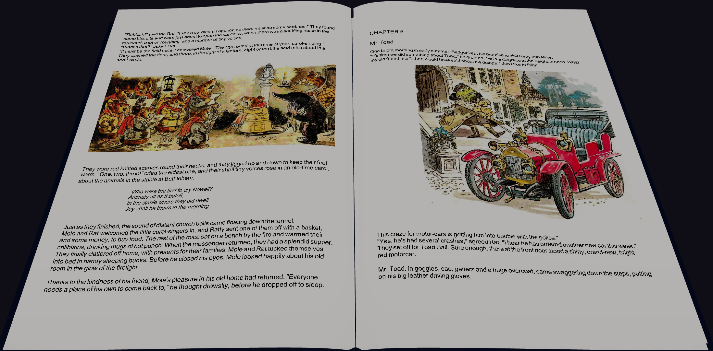
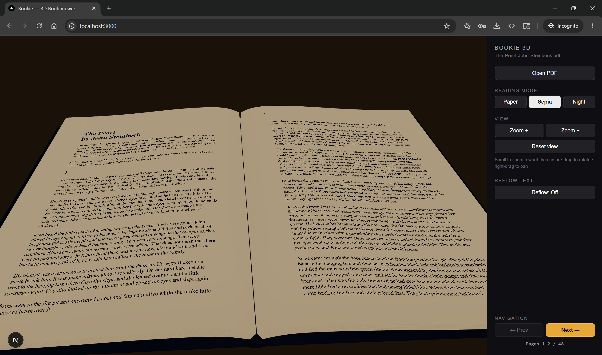
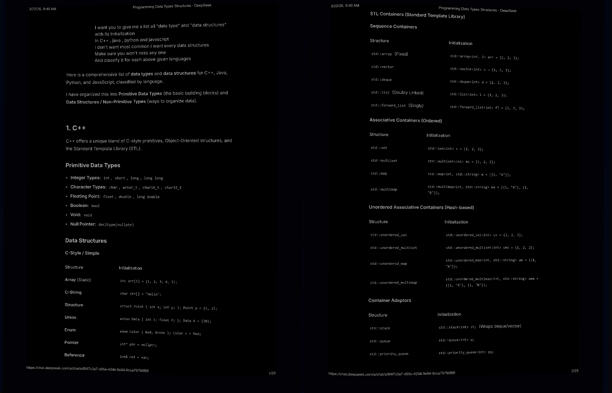
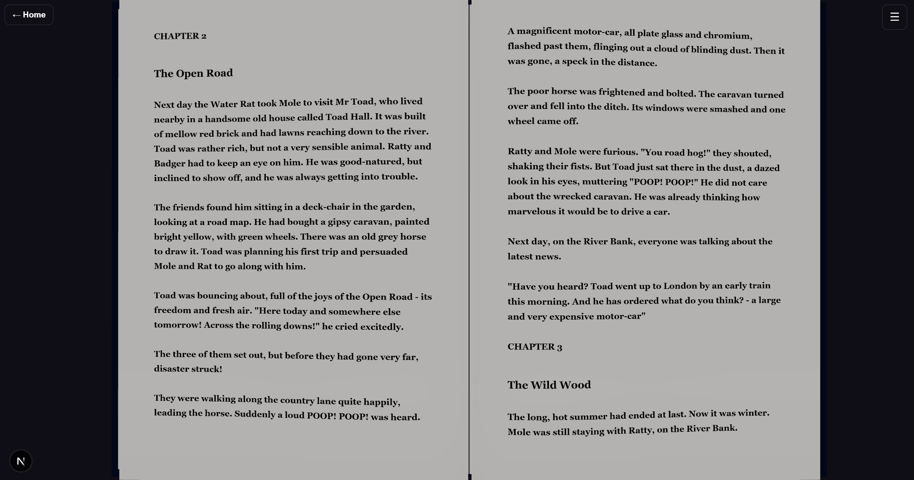
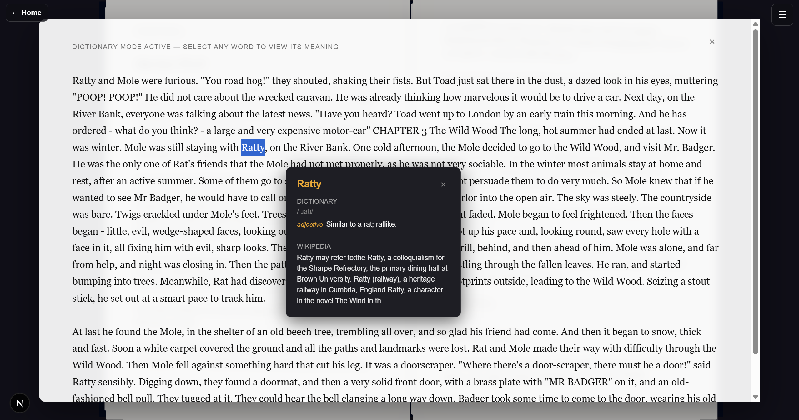
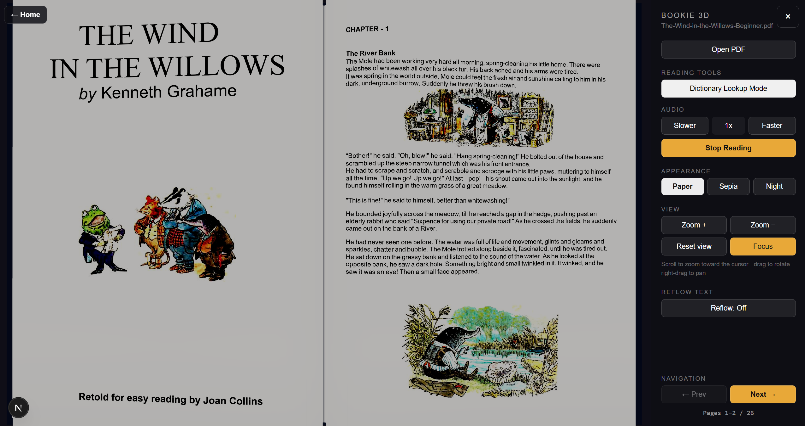

# 3D Book Reader (Bookie)

Open any PDF and read it on a realistic 3D book in the browser — two-page spreads, a clean
control sidebar, zoom-into-any-section, reading modes, and an accessibility-focused reflow mode.
Built with Next.js and React Three Fiber.

📖 **[Read the comprehensive Project Journey & Technical Documentation](./PROJECT_DOCUMENTATION.md)**

**🔗 Live demo: [3d-book-reader.vercel.app](https://3d-book-reader.vercel.app/)**

## Project status

This project is feature-complete and in final-polish mode. The reader supports client-side PDF
opening, 3D page rendering, responsive mobile/laptop controls, reading modes, Reflow text,
dyslexic-friendly typography, text-to-speech, and dictionary lookup. Future work should focus on
maintenance, browser compatibility checks, and small performance improvements rather than adding
new major features.

## Screenshots

| Paper Mode | Sepia Mode | Night Mode |
|:---:|:---:|:---:|
|  |  |  |
| **Reflow Mode** | **Dictionary Lookup** | **Text-to-Speech** |
|  |  |  |

## Features

- **Private & Client-Side** — Any PDF opens entirely in your browser using `pdf.js`. No servers, no uploads, 100% privacy.
- **Realistic 3D Immersion** — Your document is painted onto the 3D meshes of a modeled book layout. Complete with high-quality MP3 **Page Flip Audio FX** for tactile navigation.
- **Dynamic 3D Camera Controls** — Intelligent `OrbitControls` let you zoom precisely into any paragraph. Pages adaptively re-render to crystal-clear high resolutions on close-up so text is never blurry.
- **Visual Accessibility (Reflow & Reading Modes)** 
  - Switch visually between **Paper, Sepia, and Night** modes via Three.js ambient lights and `CanvasTexture` filters.
  - Turn on **Reflow Mode** to structurally extract the raw PDF text and mathematically re-typeset it (adjust fonts, weight, and line height manually). Perfect for visual impairments.
- **Text-to-Speech (TTS) Engine** — Sit back and listen. Implements native `speechSynthesis` equipped with recursive recursive paragraph-chunking that bypasses traditional browser memory limits, seamlessly flipping the page automatically when it finishes reading the current spread.
- **Dictionary / Wikipedia Integration** — Double-click any word or drag any phrase onto the interactive text overlay to trigger an API lookup. A fully styled UI popup immediately displays definitions, phonetics, and encyclopedic summaries for powerful learning without leaving the app.
- **Intuitive Navigation** — Right-hand control sidebar, responsive UI, drag & swipe support for touchpads, and `←` / `→` / `Space` keybindings.

## PDF size and page support

Bookie does not set a hard-coded PDF size limit or page-count limit. PDFs are opened locally in
the user's browser with `pdf.js`, so the practical limit depends on the device, browser memory,
GPU texture limits, and how heavy the PDF itself is. A text-based novel is much lighter than a
scanned/image-heavy textbook of the same page count.

Final project testing included a **500-page book**. Normal page navigation, modes, zoom, mobile
drawer controls, and 3D viewing worked acceptably. Some Reflow actions can feel slower on very
large books because Reflow extracts and re-typesets document text; this is expected for the
accessibility mode and is treated as an acceptable trade-off for final release.

| Device class | Comfortable PDF size | Comfortable page count |
|---|---:|---:|
| Good desktop/laptop | ~100-300 MB | ~800-1500 pages |
| Average phone | ~20-80 MB | ~200-500 pages |
| Low-end phone | ~10-30 MB | ~100-250 pages |

Important behavior notes:

- **Text-based PDFs scale best.** They parse and render more efficiently than scanned books or PDFs made of full-page images.
- **Scanned/image-heavy PDFs become laggy sooner.** Large page images increase memory, rasterization time, and GPU texture pressure.
- **Only the active spread is rendered in normal mode.** The app renders the current left/right pages and keeps a small recent-page cache for smoother back/forward navigation.
- **Reflow mode is more demanding on very large books.** When enabled, it extracts text across the document before re-typesetting, so very large PDFs may take noticeable time on first use. The app caches completed extraction work for the open PDF, so returning to Reflow is faster after the first pass.
- **Vercel is not the bottleneck for local files.** The selected PDF is not uploaded to the server; it is read client-side in the browser.

For production messaging, a good expectation is: normal books up to around **300-500 pages on
mobile**, with larger books working better on desktop. Instead of blocking large PDFs, consider
showing a warning around **100 MB** or **500+ pages** so users understand performance may vary.

## Tech stack

| Layer | Technology |
|---|---|
| Framework | Next.js 16 (App Router) |
| UI | React 19 |
| 3D rendering | React Three Fiber 9 + @react-three/drei 10 |
| 3D engine | Three.js |
| PDF rendering | pdf.js (`pdfjs-dist`) |
| Model format | glTF binary (`.glb`) |

## Requirements

- Node.js **20.9+** (required by Next.js 16)
- npm

## Getting started

```bash
git clone https://github.com/DevGurav/3d-book-reader.git
cd 3d-book-reader
npm install
npm run dev
```

Open http://localhost:3000, click **Open PDF**, and start reading.

## Controls

| Action | How |
|---|---|
| Rotate the book | Left-drag |
| Zoom into a section | Scroll wheel (zooms toward the cursor) |
| Pan | Right-drag / two-finger drag |
| Reset the view | **Reset view** button (sidebar) |
| Turn pages | **Prev / Next** buttons or `←` / `→` / `Space` |

## Scripts

| Command | Description |
|---|---|
| `npm run dev` | Start the dev server (hot reload) |
| `npm run build` | Production build |
| `npm start` | Serve the production build |

## Project structure

```
app/                      Next.js App Router (layout, page, global styles)
components/BookViewer.jsx React Three Fiber book scene — paints PDF canvases onto page meshes
lib/pdfLoader.js          Loads PDFs and rasterizes pages to canvas (pdf.js)
lib/reflow.js             Text extraction + re-typesetting for reflow mode
public/models/book.glb    The 3D book model loaded at runtime
public/models/Ultimatefinal.blend  Editable Blender source for the model
public/pdf.worker.min.mjs pdf.js web worker
```

## The 3D model

`public/models/book.glb` is loaded at runtime; PDF page canvases map onto the meshes
`left-top-page` and `right-top-page`. To edit the model, open
`public/models/Ultimatefinal.blend` in Blender and re-export the `.glb`.

## License

[MIT](LICENSE)
